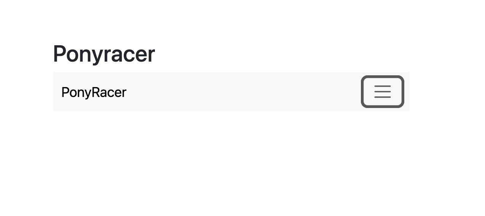
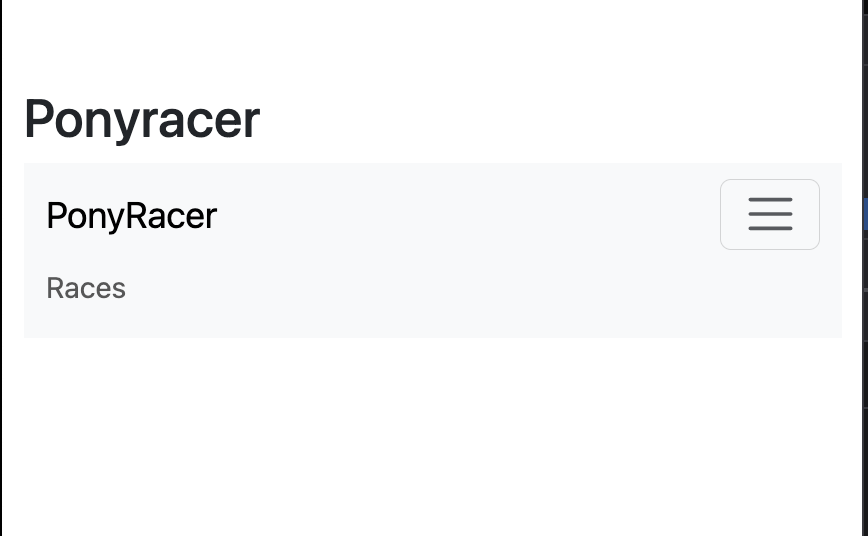

# 🧾 2 - User Story — Menu de navigation responsive

## 🎯 Contexte

L’application PonyRacer nécessite un menu de navigation permettant :

- d’afficher le titre de l’application
- d’accéder aux différentes sections (ex : Races)
- de s’adapter aux petits écrans (responsive)

## 👤 User Story

En tant qu’utilisateur,
je veux voir un menu de navigation en haut de la page
afin de pouvoir identifier l’application et accéder aux fonctionnalités disponibles,
y compris sur mobile via un menu repliable.

## ✅ Critères d’acceptation
1. Affichage du menu
   - Le menu est visible sur la page principale
   - Il contient : le texte "PonyRacer", un lien "Races"
   - Il utilise une structure compatible Bootstrap (navbar)

⚠️ Contrainte importante (tests) : Le composant doit être accessible via la balise : `<pr-menu>`

3. Responsive (comportement mobile)
   - Sur petit écran : le lien "Races" ne doit pas être visible par défaut un bouton (navbar toggler) doit être visible
   - Lors du clic sur ce bouton : le menu doit s’ouvrir
   - Lors d’un second clic : le menu doit se refermer
   

4. Gestion de l’état (Angular)

   - Le composant doit gérer un état interne : Un signal nommé navbarCollapsed, Initialisé à : `true`

👉 Signification :

    - true → menu fermé
    - false → menu ouvert

5. Interaction utilisateur
    - Un clic sur le bouton : appelle une méthode toggleNavbar()
    - Cette méthode : inverse la valeur de navbarCollapsed

6. Binding dynamique (IMPORTANT)

La classe CSS collapse doit être :

- présente quand le menu est fermé
- absente quand le menu est ouvert

⚠️ Contrainte stricte (tests) :

- La classe doit être appliquée sur : `#navbar`
- Elle doit être gérée via : `[class.collapse]="..."`

🧪 Critères techniques (issus des tests)

Tu dois implicitement respecter :

✔️ Structure DOM

Un élément avec : `id="navbar"`

Un bouton avec la classe : `navbar-toggler`
✔️ Comportement attendu
Action	Résultat attendu
Initialisation	collapse présent
1er clic	collapse retiré
2e clic	collapse ajouté
✔️ Accessibilité / sélection

Les tests utilisent :

getByRole('navigation')
getByRole('button')
getByText('PonyRacer')
getByText('Races')

👉 Donc ton HTML doit rester sémantiquement correct

⚠️ Contraintes de nommage (CRITIQUES)

Ne pas changer :

navbarCollapsed
toggleNavbar()
id="navbar"
classe navbar-toggler
texte "PonyRacer"
texte "Races"

👉 Sinon les tests échoueront

  
🔧 Signal

 Lire
- this.navbarCollapsed()

 Écrire (remplacer la valeur)
- this.navbarCollapsed.set(false)

Mettre à jour à partir de l’ancienne valeur
- this.navbarCollapsed.update(v => !v)

